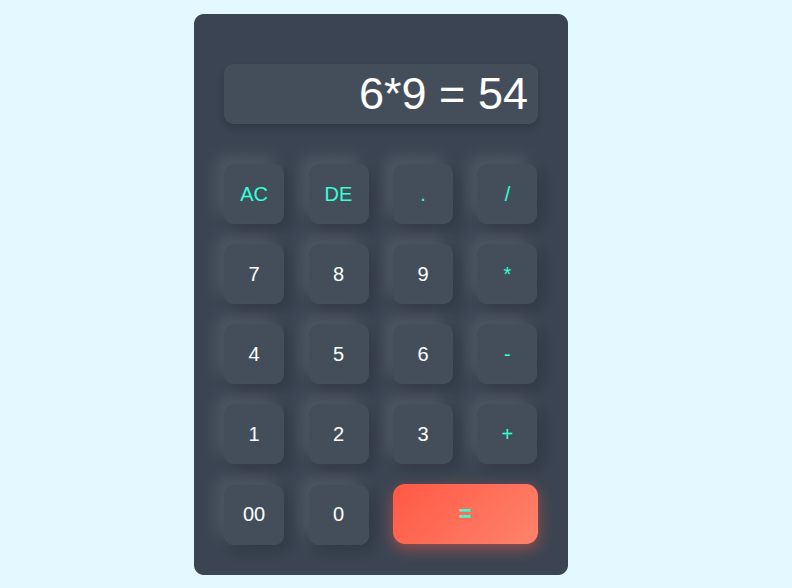

# 🧮 Calculator App

A **modern, interactive, and responsive calculator** built with **HTML, CSS, and JavaScript**, featuring hover effects, button animations, and a visually distinct equal (`=`) button for better user experience.

---

## ✨ Features
- ➕ Perform basic arithmetic operations: addition, subtraction, multiplication, division  
- 🆑 Clear (`AC`) and Delete (`DE`) buttons  
- 🟢 Distinct `=` button with gradient, hover, and pop effects  
- 🎨 Interactive hover and press effects on all buttons  
- 📱 Fully responsive layout for mobile and desktop  
- ⌨️ Keyboard support for quick input  
- 💡 Displays both input and result (e.g., `12 + 8 = 20`)  

---

## 🖼 Screenshots


---

## 🚀 Live Demo
[View Live Demo](https://shivamyadav-2005.github.io/calculator-project/)

## 📂 Project Repository
[View on GitHub](https://github.com/shivamyadav-2005/calculator)

---

## 🛠️ Technologies Used
- HTML5  
- CSS3 (Flexbox, Gradients, Hover Effects, Animations)  
- JavaScript (DOM Manipulation)  

---

## 💡 How to Use
1. Clone the repository:  
   ```bash
   git clone https://github.com/shivamyadav-2005/calculator.git
Open index.html in your browser.

Start performing calculations!

🌟 Upgrade Notes
This version includes:

Hover and press animations for buttons

Distinct and eye-catching = button with gradient & shadow

Responsive design for mobile devices

Smooth, modern UI for better usability

✍️ Author
Shivam Yadav
🔗 Portfolio

vbnet
Copy code
